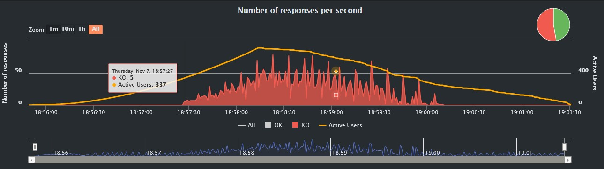
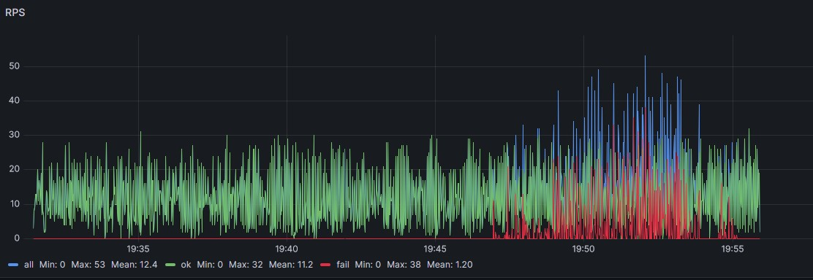
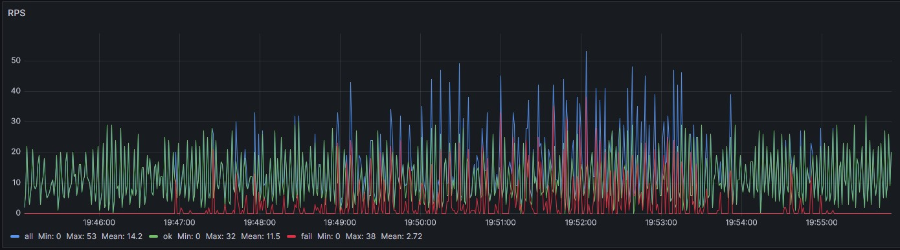
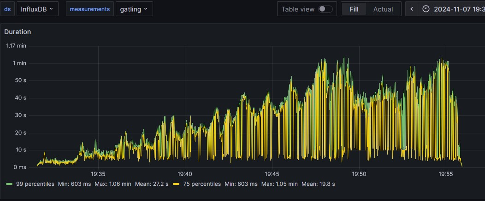
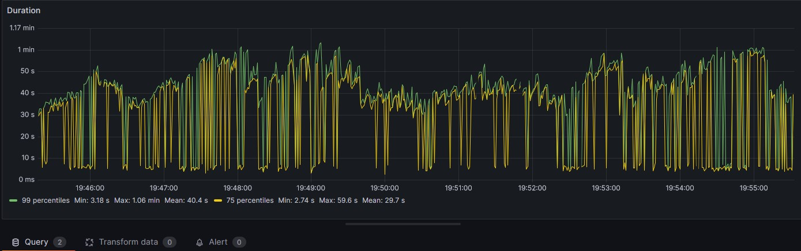
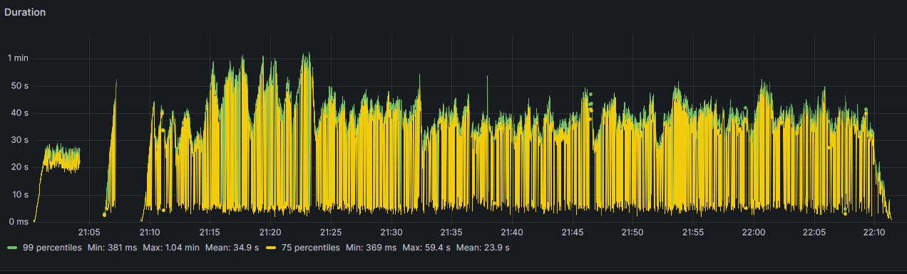
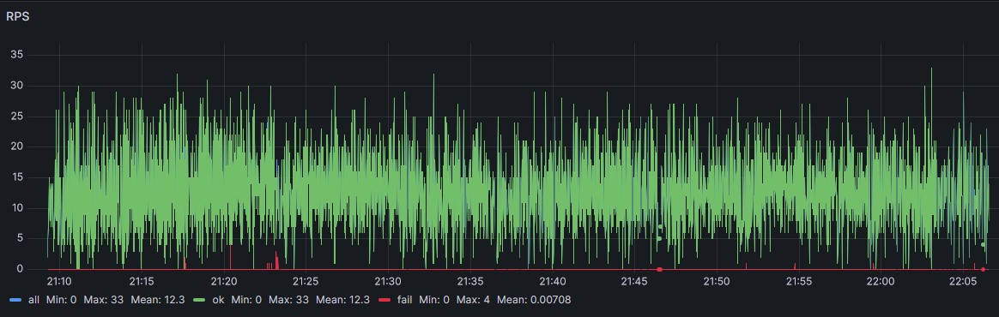

# Отчет о нагрузочном тестировании

### Тестируемый ресурс: 
  * http://webtours.load-test.ru:1080/webtours/

### Инструменты:
* maven
* gatling
* java
* influxDb + graphite
* grafana

### Запуск тестов из консоли:
win:
```
mvn gatling:test 
```

```
mvn gatling:test '-Dgatling.simulationClass=webtours.StepLoadTest'    
```

unix:
```
$ ./mvnw gatling:test 
```

### Задача: 
* Реализовать ступенчатый тест от 0 - 100% (0 RPS и до момента деградации системы - увеличение числа ошибок или времени отклика операций) с шагом в 10% (от найденного максимума) используя Gatling (длительность теста любая, лучше не меньше 20 минут). Сборщик любой. В результате должен быть код сценария + html отчет о тестах (или ссылка на grafana).   
    
* Реализовать тест надежности от 80% от максимальной производительности в течение часа.

### Итерация №1: 

* Поиск максимальной производительности. Поднимаем нагрузку по секундам 
и выходим на максимум в течение минуты. Смотрим за состоянием системы

``` 
public class FindMaximumTest extends Simulation {
    {
        setUp(
                CommonScenario.byTicketsScenario().injectOpen(
                        incrementUsersPerSec(1) // Сколько добавляем на каждом шаге
                                .times(10) // Увеличиваем нагрузку в течении 10 шагов
                                .eachLevelLasting(Duration.ofSeconds(5)) // Продолжительность каждого уровня нагрузки (5 сек минуты)
                                .separatedByRampsLasting(Duration.ofSeconds(10)) // Время между уровнями
                                .startingFrom(0) // Начинаем с нуля
                ).protocols(Base.httpProtocolCustom)).assertions(
        );
    }
}
```
### Результат:
* Рост ошибок при нагрузке более 330 пользователей работающих одновременно.
  
* Отчет HTML:
  [Посмотреть отчет](src/main/resources/reports)

### Вывод:
* Значение ~ 300-320 пользователей является максимальным при котором система может функционировать 

### Итерация №2:

* Постепенная нагрузка до найденного максимума с целью анализа работоспособности системы на пиках и анализ времени ответов при возрастающих нагрузках

``` 
public class StepLoadTest extends Simulation {
    {
        setUp(
                CommonScenario.byTicketsScenario().injectClosed(
                        incrementConcurrentUsers(33) // На каждом уровне добавляем 33 пользователя
                                .times(10) // Всего 10 уровней (0% до 100% нагрузки)
                                .eachLevelLasting(Duration.ofMinutes(2)) // Длительность каждого уровня — 2 минуты
                                .separatedByRampsLasting(Duration.ofSeconds(10)) // Плавный переход между уровнями
                                .startingFrom(0) // Начинаем с 0 пользователей
                ).protocols(Base.httpProtocolCustom)
        );
    }
}
```

### Результат:
* Ошибки начались до значения в 330 юзеров, найденного в прошлой итерации. Поэтому данная величина является не постоянной. 

* Тест показал, что максимум который может держать система это 25-30 rps. При нагрузках свыше начинают появляться ошибки.   

### Графики rps из grafana:
  
  

### График времени ответов по ходу всего теста:


### График времени ответов за последние 10 минут на пиках нагрузки:

* среднее время ответа для успешного запроса для 99 percentile - 40s
* среднее время ответа для успешного запроса для 75 percentile -  29,7s


* Отчет HTML:
  [Посмотреть отчет](src/main/resources/reports)

### Итерация №3:

* Тестирование стабильности. В течение часа подается нагрузка в 20 RPS (80% от 25)

``` 
public class ReliabilityTest extends Simulation {
    {
        setUp(
                CommonScenario.byTicketsScenario().injectClosed(constantConcurrentUsers(200).during(Duration.ofMinutes(60)))
        )
                .throttle(
                        reachRps(20).in(10),            // Поднимаем значение RPS == 20 за 10 секунд
                        holdFor(Duration.ofMinutes(60)),   // Держать на уровне 20 RPS в течение 60 минут
                        jumpToRps(10),                   // После этого понизить до 10 RPS в секунду
                        holdFor(Duration.ofMinutes(2))     // Держать 10 RPS в течение 2 минуты
                ).protocols(Base.httpProtocolCustom);
    }
}
```

### Результат:
* Общее число запросов: 45900
* Число ошибок со статус-кодом 500: 4
* Число падений запросов по таймауту: 20
* среднее время ответа для успешного запроса для 99 percentile - 34s
* среднее время ответа для успешного запроса для 75 percentile -  23,9s

### График времени ответов за последние 10 минут на пиках нагрузки:


### График  rps из grafana:


* Отчет HTML:
  [Посмотреть отчет](src/main/resources/reports)